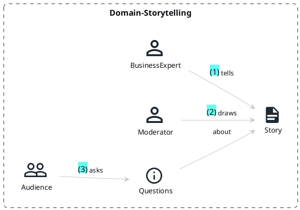

# DDD with code

This repository contains examples of how DDD methods like Domain Storytelling (see
[Buch](https://www.amazon.com/Domain-Storytelling-Collaborative-Domain-Driven-Addison-Wesley-ebook/dp/B099ZNXCJT]),
[Link](https://domainstorytelling.org/))
can be mastered in code and a repository.

First for Domain Storytelling we use the corresponding [plug-in](https://github.com/johthor/DomainStory-PlantUML)
in [PlantUML](https://plantuml.com/).

## Domain Storytelling

Domain storytelling is a workshop format, where IT experts and business specialists work together to gather business
requirements.
It was introduced by Stefan Hofer and Henning Schwentner.
The workshop covers a certain scope, e.g., the Sales area of an enterprise.
A business expert tells their story, whereas the story is really a story and not a list of requirements.
A moderator - ideally an architect - draws the story sentence by sentence.
The workshop audience can ask question to precise the story.
Afterwards, the next business expert tells their story.
Using the different stories, the overall story can be generalized.

